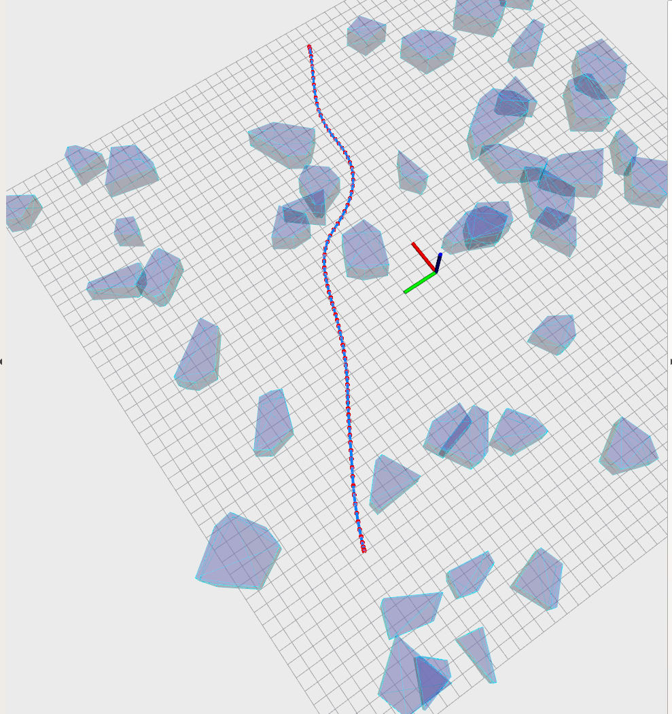
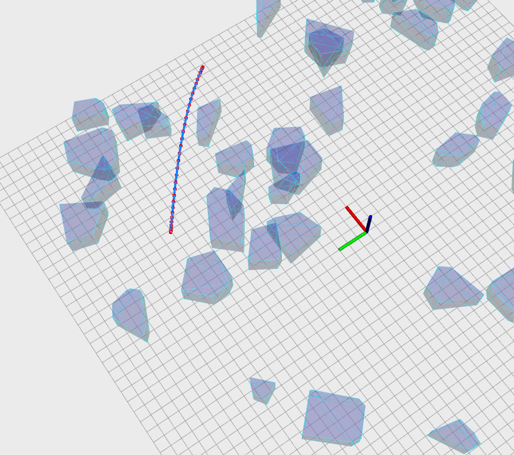
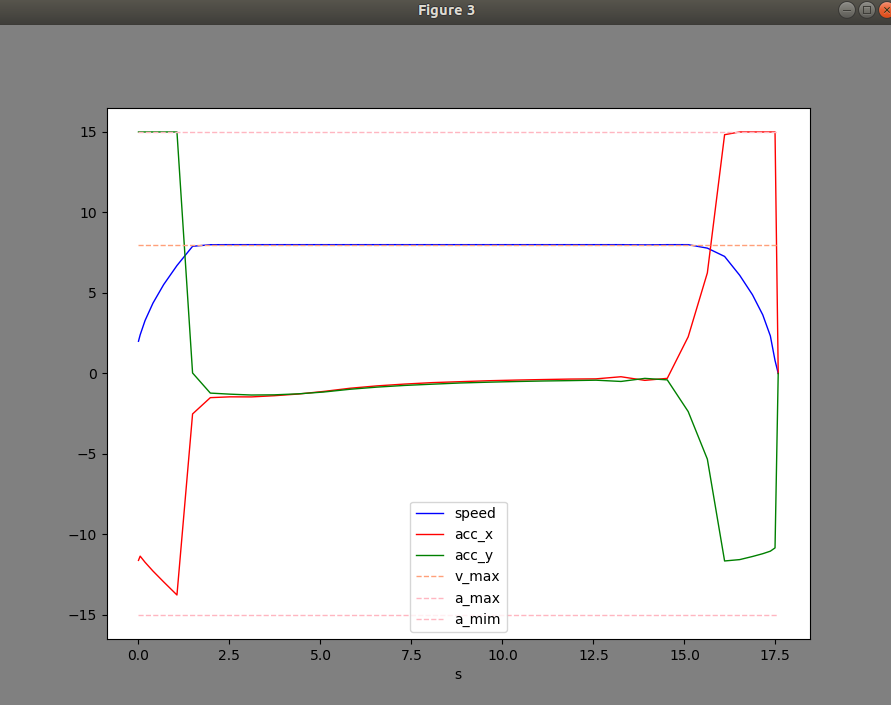

<!--
 * @Author: Shirley
 * @Date: 2022-09-20 14:46:31
 * @LastEditors: “Shirley” “todo@163.com”
 * @LastEditTime: 2022-10-09 10:27:08
 * @Description: file content
-->

# Task

《机器人中的数值优化》HW5
- 生成凸多边形障碍；
- 生成光滑曲线路径;
- TOPP问题，生成速度参数

# How to run

```bash
catkin_make
source devel/setup.bashrc
roslaunch gcopter curve_gen.launch

# plot topp results:
# open another terminal
source devel/setup.bashrc
rosrun gcopter vis.py
```

# How to set parameters

in config/corve_gen.yaml

```yaml
# polygon parameters
PolysNum: 15           # Number of polygons
PolyPlaneNum: 50 # Number of planes of each polygon
PolyXYBound: 25    # bound of center of polygons
PolyUVBound: 5      # bound of scale of polygons

# topp parameters
v_max: 8
a_max: 15
v_start: 2
v_end: 0
sub_pieces_num: 1 # number of topp pieces in each polynomial trajectory
```

# Results



